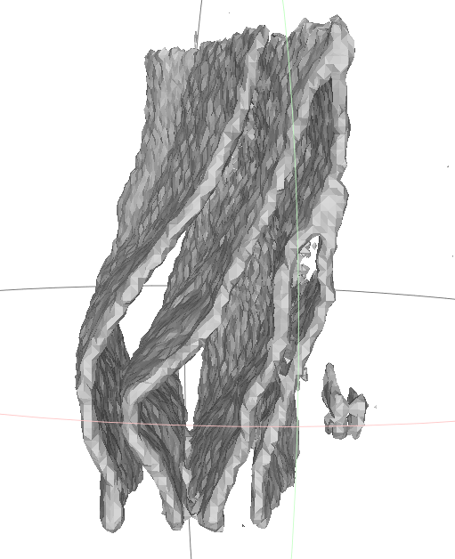

# 概要

## 現在の取り組み
- ニューラル場(NeuralField)を用いた三次元形状を作成するためのDecoderをチューニング中
    - Decoder
        - DeepSDF
            - positionalEncoding
            - HashEncoding
        - SIREN
            - positionalEncoding
            - HashEncoding
        - InstantNGP
            - positionalEncoding
            - HashEncoding

- Encoderは3DCNNで作成中

## 補足
- ニューラル場を利用した3次元形状の作成だと下記のような形（学習形状を減らして上手くいったもの）
